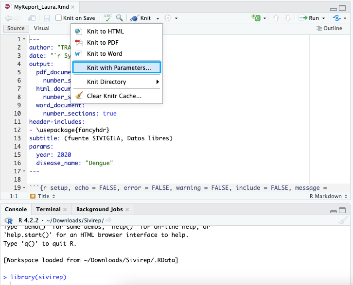
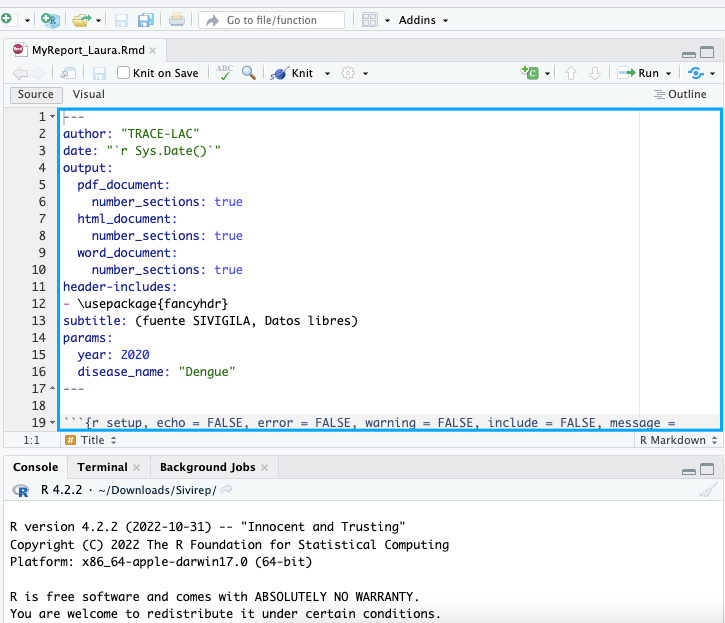
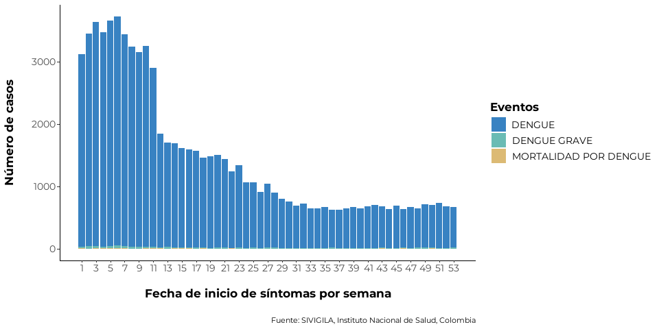
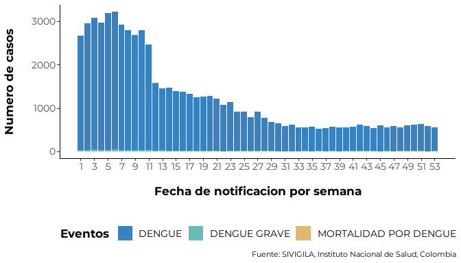
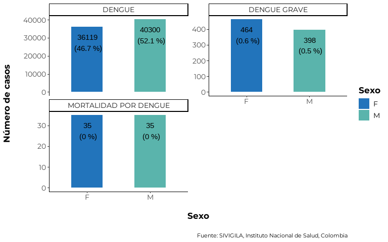
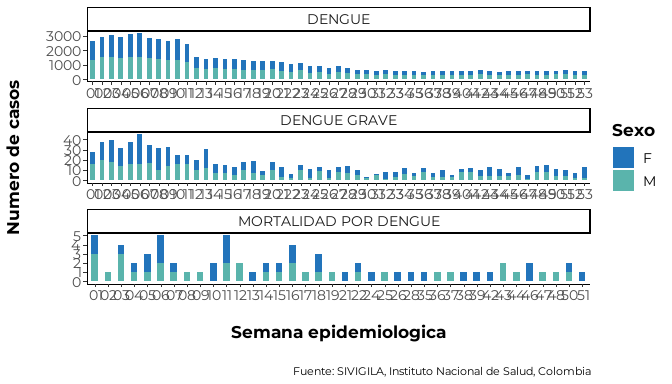
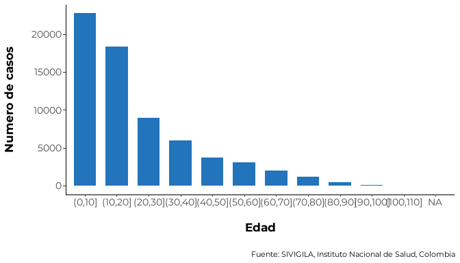
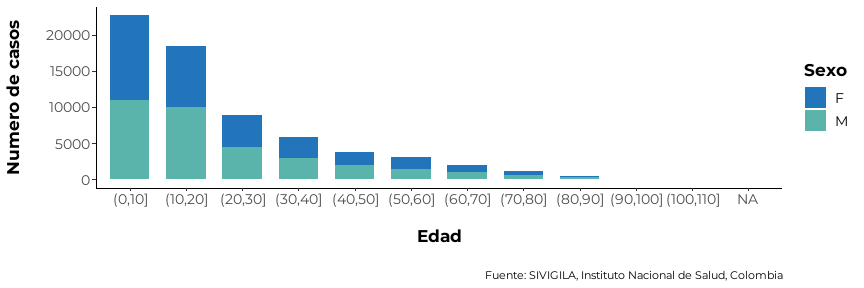
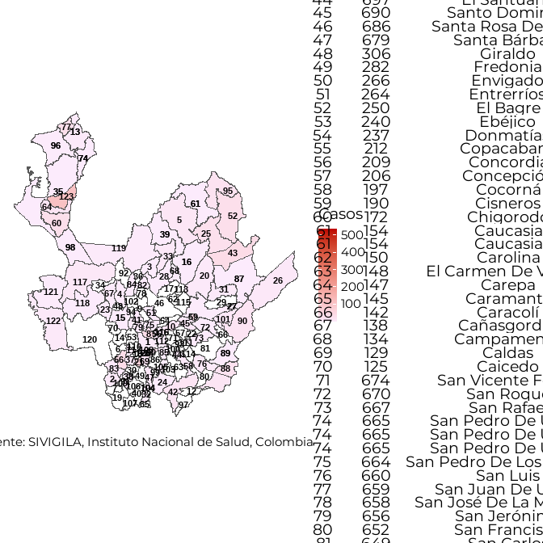

<!-- README.md is generated from README.Rmd. Please edit that file -->

``` r
library(sivirep)
```

## *sivirep*: Generación automatizada de reportes a partir de bases de datos de vigilancia epidemiológica 

<!-- badges: start -->

[](https://opensource.org/licenses/MIT)
[](https://github.com/epiverse-trace/sivirep/actions/workflows/R-CMD-check.yaml)
[](https://app.codecov.io/gh/epiverse-trace/readepi?branch=main)
[](https://www.reconverse.org/lifecycle.html#maturing)

<!-- badges: end -->

La versión actual de *sivirep* 0.0.2 proporciona funciones para la
manipulación de datos y la generación de reportes automatizados basados
en las bases de datos individualizadas de casos de
[SIVIGILA](https://www.ins.gov.co/Direcciones/Vigilancia/Paginas/SIVIGILA.aspx),
que es el sistema oficial de vigilancia epidemiológica de Colombia.

## Motivación

América Latina ha progresado en la calidad de sus sistemas de
notificación y vigilancia epidemiológica. En particular, Colombia ha
mejorado a lo largo de los años la calidad, la accesibilidad y la
transparencia de su sistema oficial de vigilancia epidemiológica,
[SIVIGILA](https://www.ins.gov.co/Direcciones/Vigilancia/Paginas/SIVIGILA.aspx).
Este sistema está regulado por el [Instituto Nacional de
Salud](https://www.ins.gov.co) de Colombia y es operado por miles de
trabajadores de la salud en las secretarías de salud locales, hospitales
y unidades primarias generadoras de datos.

Sin embargo, todavía existen desafíos, especialmente a nivel local, en
cuanto a la oportunidad y la calidad del análisis epidemiológico y de
los informes epidemiológicos. Estas tareas pueden requerir una gran
cantidad de trabajo manual debido a limitaciones en el entrenamiento
para el análisis de datos, el tiempo que se requiere invertir, la
tecnología y la calidad del acceso a internet en algunas regiones de
Colombia.

El objetivo de `sivirep` es proporcionar un conjunto de herramientas
para:

1)  Descargar, preprocesar y preparar los datos de SIVIGILA para su
    posterior análisis.
2)  Generar informes epidemiológicos automatizados adaptables al
    contexto.
3)  Proporcionar retroalimentación sobre el sistema de vigilancia al
    proveedor de la fuente de datos.

## Potenciales usuarios

- Profesionales de salud pública y de epidemiología de campo que
  utilizan la fuente de datos de SIVIGILA a nivel local.
- Estudiantes del área de la salud y epidemiología.
- Investigadores y analistas de datos a nivel nacional e internacional.

## Instalación

Puedes instalar la versión de desarrollo de `sivirep` desde GitHub con
el siguiente comando:

``` r
install.packages("pak")
pak::pak("epiverse-trace/sivirep")
```

## Inicio rápido

Puedes revisar las enfermedades y los años disponibles de forma libre
utilizando:

``` r
lista_eventos <- list_events()
knitr::kable(lista_eventos)
```

|     | enfermedad                                                            | aa                                                                                                   |
|:----|:----------------------------------------------------------------------|:-----------------------------------------------------------------------------------------------------|
| 1   | Accidente ofídico                                                     | 2007, 2008, 2009, 2010, 2011, 2012, 2013, 2014, 2015, 2016, 2017, 2018, 2019, 2020, 2021, 2022       |
| 2   | Agresiones Por Animales Potencialmente Transmisores De Rabia          | 2007, 2008, 2009, 2010, 2011, 2012, 2013, 2014, 2015, 2016, 2017, 2018, 2019, 2020, 2021, 2022       |
| 3   | Anomalías congénitas                                                  | 2010, 2011, 2012, 2013, 2014, 2015, 2016, 2017, 2018, 2019, 2020, 2021, 2022                         |
| 4   | Bajo Peso Al Nacer                                                    | 2012, 2013, 2014, 2015, 2016, 2017, 2018, 2019, 2020, 2021, 2022                                     |
| 5   | Cáncer De La Mama Y Cuello Uterino                                    | 2016, 2017, 2018, 2019, 2020, 2021                                                                   |
| 6   | Cáncer Infantil                                                       | 2014, 2015, 2016, 2017, 2018, 2019, 2020, 2021, 2022                                                 |
| 7   | Chagas                                                                | 2012, 2013, 2014, 2015, 2016, 2017, 2018, 2019, 2020, 2021, 2022                                     |
| 8   | Chikunguya                                                            | 2014, 2015, 2016, 2017, 2018, 2019, 2020, 2021, 2022                                                 |
| 9   | Dengue                                                                | 2007, 2008, 2009, 2010, 2011, 2012, 2013, 2014, 2015, 2016, 2017, 2018, 2019, 2020, 2021, 2022       |
| 10  | Dengue Grave                                                          | 2007, 2008, 2009, 2010, 2011, 2012, 2013, 2014, 2015, 2016, 2017, 2018, 2019, 2020, 2021, 2022       |
| 11  | ESI - Irag (Vigilancia Centinela)                                     | 2008, 2009, 2010, 2011, 2012, 2013, 2014, 2015, 2016, 2017, 2018, 2019, 2020, 2021, 2022             |
| 12  | Evento Adverso Grave Posterior A La Vacunación                        | 2007, 2008, 2009, 2010, 2011, 2012, 2013, 2014, 2015, 2016, 2017, 2018, 2019, 2020, 2021, 2022       |
| 13  | Exposición A Flúor                                                    | 2012, 2013, 2014, 2015, 2016, 2017, 2018, 2019                                                       |
| 14  | Fiebre Amarilla                                                       | 2007, 2008, 2009, 2013, 2016, 2018                                                                   |
| 15  | Fiebre Tifoidea Y Paratifoidea                                        | 2007, 2008, 2009, 2010, 2011, 2012, 2013, 2014, 2015, 2016, 2017, 2018, 2019, 2020, 2021, 2022       |
| 16  | Hepatitis A                                                           | 2007, 2008, 2009, 2010, 2011, 2012, 2013, 2014, 2015, 2016, 2017, 2018, 2019, 2020, 2021, 2022       |
| 17  | Hepatitis B, C Y Coinfección Hepatitis B Y Delta                      | 2007, 2008, 2009, 2010, 2011, 2012, 2013, 2014, 2015, 2016, 2017, 2018, 2019, 2020, 2021, 2022       |
| 18  | Hepatitis C                                                           | 2014, 2015, 2016, 2017, 2018, 2019, 2020, 2021, 2022                                                 |
| 19  | Hipotiroidismo congénito                                              | 2007, 2008, 2009, 2010, 2011, 2012, 2013, 2014, 2015, 2016, 2017, 2018, 2019, 2020, 2021, 2022       |
| 20  | Infección Respiratoria Aguda Grave Irag Inusitada                     | 2009, 2010, 2011, 2012, 2013, 2014, 2015, 2016, 2017, 2018, 2019, 2020, 2021, 2022                   |
| 67  | INTENTO DE SUICIDIO                                                   |                                                                                                      |
| 21  | Intoxicación Por Gases                                                | 2010, 2011, 2012, 2013, 2014, 2015, 2016, 2017, 2018, 2019, 2020, 2021, 2022                         |
| 22  | Intoxicación Por Medicamentos                                         | 2007, 2008, 2009, 2010, 2011, 2012, 2013, 2014, 2015, 2016, 2017, 2018, 2019, 2020, 2021, 2022       |
| 23  | Intoxicación Por Metales Pesados                                      | 2007, 2008, 2009, 2010, 2011, 2012, 2013, 2014, 2015, 2016, 2017, 2018, 2019, 2020, 2021, 2022       |
| 24  | Intoxicación Por Metanol                                              | 2007, 2008, 2009, 2010, 2011, 2012, 2013, 2014, 2015, 2016, 2017, 2018, 2019, 2020, 2021, 2022       |
| 25  | Intoxicación Por Otras Sustancias químicas                            | 2012, 2013, 2014, 2015, 2016, 2017, 2018, 2019, 2020, 2021, 2022                                     |
| 26  | Intoxicación Por Plaguicidas                                          | 2007, 2008, 2009, 2010, 2011, 2012, 2013, 2014, 2015, 2016, 2017, 2018, 2019, 2020, 2021, 2022       |
| 27  | Intoxicación Por Solventes                                            | 2007, 2008, 2009, 2010, 2011, 2012, 2013, 2014, 2015, 2016, 2017, 2018, 2019, 2020, 2021, 2022       |
| 28  | Intoxicación Por Sustancias Psicoactivas                              | 2010, 2011, 2012, 2013, 2014, 2015, 2016, 2017, 2018, 2019, 2020, 2021, 2022                         |
| 29  | Leishmaniasis cutánea                                                 | 2007, 2008, 2009, 2010, 2011, 2012, 2013, 2014, 2015, 2016, 2017, 2018, 2019, 2020, 2021, 2022       |
| 30  | Leishmaniasis Mucosa                                                  | 2007, 2008, 2009, 2010, 2011, 2012, 2013, 2014, 2015, 2016, 2017, 2018, 2019, 2020, 2021, 2022       |
| 31  | Leishmaniasis Visceral                                                | 2007, 2008, 2009, 2010, 2011, 2012, 2013, 2014, 2015, 2016, 2017, 2018, 2019, 2020, 2021, 2022       |
| 32  | Lepra                                                                 | 2007, 2008, 2009, 2010, 2011, 2012, 2013, 2014, 2015, 2016, 2017, 2018, 2019, 2020, 2021, 2022       |
| 33  | Leptospirosis                                                         | 2007, 2008, 2009, 2010, 2011, 2012, 2013, 2014, 2015, 2016, 2017, 2018, 2019, 2020, 2021, 2022       |
| 34  | Lesiones Por pólvora Y Explosivos                                     | 2007, 2008, 2009, 2010, 2011, 2012, 2013, 2014                                                       |
| 35  | Leucemia Aguda Pediátrica Linfoide                                    | 2008, 2009, 2010, 2011, 2012, 2013, 2014, 2015, 2016, 2017, 2018, 2019, 2020, 2021, 2022             |
| 36  | Leucemia Aguda Pediátrica Mieloide                                    | 2008, 2009, 2010, 2011, 2012, 2013, 2014, 2015, 2016, 2017, 2018, 2019, 2020, 2021, 2022             |
| 66  | MALARIA                                                               |                                                                                                      |
| 37  | Malaria Asociada (Formas Mixtas)                                      | 2007, 2008, 2009, 2010, 2011, 2012, 2013, 2014, 2015, 2016, 2017, 2018, 2019, 2020, 2021, 2022       |
| 38  | Malaria Complicada                                                    | 2007, 2008, 2009, 2010, 2011, 2012, 2013, 2014, 2015, 2016, 2017, 2018, 2019, 2020, 2021, 2022       |
| 39  | Malaria Falciparum                                                    | 2007, 2008, 2009, 2010, 2011, 2012, 2013, 2014, 2015, 2016, 2017, 2018, 2019, 2020, 2021, 2022       |
| 40  | Malaria Vivax                                                         | 2007, 2008, 2009, 2010, 2011, 2012, 2013, 2014, 2015, 2016, 2017, 2018, 2019, 2020, 2021, 2022       |
| 41  | Meningitis Bacteriana Y Enfermedad Meningocócica                      | 2007, 2008, 2009, 2010, 2011, 2012, 2013, 2014, 2014, 2015, 2016, 2017, 2018, 2019, 2020, 2021, 2022 |
| 42  | Meningitis Meningocócica                                              | 2007, 2008, 2009, 2010, 2011, 2012, 2013, 2014, 2015, 2016, 2017, 2018, 2019, 2020, 2021, 2022       |
| 43  | Meningitis Por Haemophilus Influenzae                                 | 2007, 2008, 2009, 2010, 2011, 2012, 2013, 2014, 2015, 2016, 2017, 2018, 2019, 2020, 2021, 2022       |
| 44  | Meningitis Por Neumococo                                              | 2007, 2008, 2009, 2010, 2011, 2012, 2013, 2014, 2015, 2016, 2017, 2018, 2019, 2020, 2021, 2022       |
| 45  | Meningitis Tuberculosa                                                | 2007, 2008, 2009, 2010, 2011, 2012, 2013, 2014, 2015, 2016, 2017, 2018, 2019, 2020, 2021, 2022       |
| 46  | MORBILIDAD POR EDA                                                    | 2013, 2015, 2016, 2017, 2018, 2019, 2020, 2021, 2022                                                 |
| 47  | MORBILIDAD POR IRA                                                    | 2012, 2013, 2014, 2015, 2016, 2017, 2018, 2019, 2020, 2021, 2022                                     |
| 48  | Mortalidad Materna                                                    | 2007, 2008, 2009, 2010, 2011, 2012, 2013, 2014, 2015, 2016, 2017, 2018, 2019, 2020, 2021, 2022       |
| 49  | Mortalidad Perinatal Y Neonatal Tardía                                | 2007, 2008, 2009, 2010, 2011, 2012, 2013, 2014, 2015, 2016, 2017, 2018, 2019, 2020, 2021, 2022       |
| 50  | Mortalidad Por Dengue                                                 | 2007, 2008, 2009, 2010, 2011, 2012, 2013, 2014, 2015, 2016, 2017, 2018, 2019, 2020, 2021, 2022       |
| 51  | Mortalidad Por Desnutrición                                           | 2013, 2014, 2015, 2016, 2017, 2018, 2019, 2020, 2021, 2022                                           |
| 52  | Mortalidad Por Eda 0-4 Años                                           | 2007, 2008, 2009, 2010, 2011, 2012, 2013, 2014, 2015, 2016, 2017, 2018, 2019, 2020, 2021, 2022       |
| 53  | Mortalidad Por Ira                                                    | 2007, 2008, 2009, 2010, 2011, 2012, 2013, 2014, 2015, 2016, 2017, 2018, 2019, 2020, 2021, 2022       |
| 54  | Parotiditis                                                           | 2007, 2008, 2009, 2010, 2011, 2012, 2013, 2014, 2015, 2016, 2017, 2018, 2019, 2020, 2021, 2022       |
| 55  | Rabia Humana                                                          | 2007, 2008, 2009, 2010, 2012, 2015, 2016, 2017, 2020                                                 |
| 56  | Sarampión                                                             | 2011, 2012, 2013, 2015, 2018, 2019, 2020                                                             |
| 57  | Tétanos Accidental                                                    | 2007, 2008, 2009, 2010, 2011, 2012, 2013, 2014, 2015, 2016, 2017, 2018, 2019, 2020, 2021, 2022       |
| 58  | Tétanos Neonatal                                                      | 2007, 2008, 2009, 2010, 2012, 2014, 2015, 2016, 2017, 2018, 2019, 2020, 2021, 2022                   |
| 59  | Tos Ferina                                                            | 2007, 2008, 2009, 2010, 2011, 2012, 2013, 2014, 2015, 2016, 2017, 2018, 2019, 2020, 2021, 2022       |
| 60  | Tracoma                                                               | 2017, 2018, 2019, 2022                                                                               |
| 61  | Tuberculosis Extra Pulmonar                                           | 2007, 2008, 2009, 2010, 2011, 2012, 2013, 2014, 2015, 2016, 2017, 2018, 2019, 2020, 2021, 2022       |
| 62  | Tuberculosis Farmacorresistente                                       | 2011, 2012, 2013, 2014, 2015, 2016, 2017, 2018, 2019, 2020, 2021, 2022                               |
| 63  | Tuberculosis Pulmonar                                                 | 2007, 2008, 2009, 2010, 2011, 2012, 2013, 2014, 2015, 2016, 2017, 2018, 2019, 2020, 2021, 2022       |
| 64  | Varicela Individual                                                   | 2007, 2008, 2009, 2010, 2011, 2012, 2013, 2014, 2015, 2016, 2017, 2018, 2019, 2020, 2021, 2022       |
| 65  | Vigilancia En Salud Pública De La Violencia De Género E Intrafamiliar | 2012, 2013, 2014, 2015, 2016, 2017, 2018, 2019, 2020, 2021, 2022                                     |

## Versiones futuras

Las versiones futuras de `sivirep` podrían incluir:

- Interacción con otras fuentes de datos en Colombia.
- Otros sistemas de vigilancia epidemiológica en América Latina.

## Contribuciones

Las contribuciones son bienvenidas via [pull
requests](https://github.com/epiverse-trace/sivirep/pulls).

Los contribuyentes al paquete incluyen:

- [Geraldine Gómez-Millán](https://github.com/GeraldineGomez) (author)

- [Zulma M. Cucunubá](https://github.com/zmcucunuba) (author)

- [Hugo Gruson](https://github.com/Bisaloo) (contributor)

- [Laura Gómez-Bermeo](https://github.com/lgbermeo) (contributor to
  documentation)

- [Miguel Gámez](https://github.com/megamezl) (contributor)

- Jennifer Méndez-Romero (contributor)

- Johan Calderón (contributor)

- Claudia Huguett-Aragón (contributor)

- Lady Flórez-Tapiero (contributor)

- Verónica Tangarife-Arredondo (contributor)

## Código de conducta

Por favor, ten en cuenta que el proyecto `sivirep` se publica con un
[Código de Conducta para
Contribuyentes](https://contributor-covenant.org/version/2/0/CODE_OF_CONDUCT.html).
Al contribuir a este proyecto, aceptas cumplir con sus términos.

## Comenzar

### Para reportes automatizados

Después de la instalación de `sivirep`, puedes comenzar importando el
paquete a través del siguiente comando:

``` r
library(sivirep)
```

Ante de iniciar con el reporte automatizado, revisa la lista de
enfermedades disponibles para hacer un reporte con `sivirep` en:

``` r
list_events()
```

Actualmente, `sivirep` provee una plantilla de reporte llamada
`Reporte Básico {sivirep}`, la cual contiene seis secciones y recibe los
siguientes parámetros de entrada: el nombre de la enfermedad, el año, el
nombre de departamento (opcional) y nombre del municipio (opcional) para
descargar los datos de la fuente de SIVIGILA.

Para hacer uso de la plantilla del reporte se deben seguir los
siguientes pasos:

1.  En RStudio hacer click *‘File/New File/R’* Markdown:


2.  Selecciona la opción del panel izquierdo: *‘From Template’*, después
    selecciona el template del reporte llamado
    `Reporte Básico {sivirep}`, indica el nombre que deseas para el
    reporte (i.e. Reporte_Laura), la ubicación donde deseas guardarlo y
    presiona *‘Ok’*.


3.  A continuación, podrás seleccionar el nombre de la enfermedad, el
    año, el departamento (opcional) y el municipio (opcional) del
    reporte. Esta acción descargará los datos deseados y también
    proporcionará la plantilla en un archivo R Markdown (.Rmd). Para
    esto, es importante encontrar el botón *‘Knit’*, desplegar las
    opciones y seleccionar *‘Knit with parameters’*.



4.  Espera unos segundos mientras el informe se genera en un archivo
    PDF.

5.  Puedes agregar, editar, eliminar y personalizar las secciones del
    reporte en el archivo R Markdown generado anteriormente.



Para obtener más detalles sobre plantillas y reportes genéricos de R
Markdown, por favor consulta [rmarkdown
templates](https://rstudio.github.io/rstudio-extensions/rmarkdown_templates.html).

## Para análisis o reportes personalizados

Esta sección proporciona un conjunto básico de instrucciones para usar
`sivirep` 0.0.2 si: - Ya has producido un archivo .Rmd y deseas editar
un reporte. - Deseas realizar análisis personalizados sin un archivo
.Rmd.

### 1. Importación de datos de SIVIGILA

La fuente de SIVIGILA proporciona los datos de la lista de casos
históricos hasta el último año epidemiológico cerrado. El cierre de un
año epidemiológico generalmente ocurre en abril del siguiente año (por
ejemplo, si estás utilizando `sivirep` en marzo de 2023, es posible que
puedas acceder a los datos históricos hasta diciembre de 2021) para la
mayoría de las enfermedades, con algunas excepciones.

Por favor, verifica las enfermedades y años disponibles utilizando:

``` r
lista_eventos <- list_events()
```

Una vez que hayas decidido la enfermedad y el año de la cual deseas
obtener la información, `import_data_event` es la función que permite la
importación de datos desde la fuente de SIVIGILA utilizando un formato
parametrizado basado en la enfermedad y el año.

``` r
data_event <-  import_data_event(year = 2020,
                                 nombre_event = "Dengue")
```

##### 💡 Tip 1 - Evita retrasos en el tiempo al importar los datos

- `sivirep` 0.0.2 está diseñado para ayudar con el acceso a la fuente de
  SIVIGILA. Este proceso de descarga de información puede tomar unos
  minutos dependiendo del tamaño del conjunto de datos. Para evitar
  descargar los mismos datos repetidamente, puedes utilizar
  `cache = TRUE` en la función `import_data_event`. Esta opción está
  configurada de forma predeterminada.

### 2. Limpieza de datos de SIVIGILA

Los datos de SIVIGILA son una fuente de información oficial altamente
confiable, con certificación ISO de calidad de datos. Sin embargo, a
veces puede haber algunos valores atípicos en los datos que requieran
una limpieza adicional.

`sivirep` proporciona una función genérica llamada
`limpiar_data_sivigila` que envuelve diversas tareas para identificar y
corregir errores, inconsistencias y discrepancias en los conjuntos de
datos con el fin de mejorar su calidad y precisión. Este proceso puede
incluir la eliminación de duplicados, la corrección de errores
tipográficos, el reemplazo de valores faltantes y la validación de
datos, entre otras tareas, como eliminar fechas improbables, limpiar
códigos de geolocalización y estandarizar los nombres de las columnas y
las categorías de edad.

``` r
data_event_limp <- limpiar_data_sivigila(data_event = data_event, year = 2020)
```

Las funciones de limpieza dentro de `limpiar_data_sivigila` se han
recopilado y creado en base a la experiencia de epidemiólogos de campo.
Estas pueden incluir funciones internas como:

- `limpiar_encabezado`: función que limpia y estandariza los nombres de
  las columnas de los datos de lista de casos de SIVIGILA basándose en
  el diccionario de datos de SIVIGILA.

- `limpiar_edad_event`: función que limpia las edades de los datos de
  lista de casos de SIVIGILA.

- `format_fecha`: función que da un formato específico a una fecha.

- `limpiar_fecha_event`: función que limpia las fechas de los datos de
  enfermedades.

- `limpiar_cods_dpto`: función que limpia los códigos geográficos de
  departamentos en los datos de enfermedades.

El usuario puede utilizar estas funciones individualmente o simplemente
utilizar la función envolvente genérica `limpiar_data_sivigila`.

### 3. Filtrar casos

`sivirep` proporciona una función que permite filtrar los datos de
enfermedades por departamento o nombre del municipio llamada
`geo_filtro`. Esto permite al usuario crear un informe a nivel
subnacional, seleccionando casos específicos basados en la ubicación
geográfica.

``` r
data_event_filtrada <- geo_filtro(data_event = data_event_limp,
                                  nombre_dpto = "Chocó")
```

### 4. Distribución temporal de casos

En `sivirep`, la distribución temporal de casos se define por las
variables de fecha de inicio de síntomas y fecha de notificación. Para
cada una de estas variables, existen funciones especializadas para
agrupar los datos y generar los gráficos.

#### 4.1. Agrupar los datos por fecha de inicio de síntomas en la escala temporal deseada

Para generar la distribución de casos por fecha de inicio de síntomas,
es necesario agrupar los datos por estas variables. `sivirep`
proporciona una función que permite esta agrupación llamada
`agrupar_fecha_inisintomas`.

``` r
casos_ini_sintomas <- agrupar_fecha_inisintomas(data_event =
                                                  data_event_limp)
```

##### 💡 Tip 2 - Obtén los primeros n meses con más casos

- Al construir una sección del reporte o analizar estos datos, puede ser
  útil obtener los meses con más casos. En `sivirep`, puedes utilizar la
  función `obtener_meses_mas_casos` para obtener esta información.

El gráfico que permite visualizar esta distribución se debe generar con
la función `plot_fecha_inisintomas`. Ten en cuenta que, incluso si has
agrupado los datos por día, es posible que prefieras representarlo por
semana epidemiológica, como en:

``` r
plot_fecha_inisintomas(data_agrupada = casos_ini_sintomas,
                       uni_marca = "semanaepi")
```

<!-- -->

#### 4.2. Agrupar los datos por fecha de notificación en la escala temporal deseada

El proceso para generar la distribución de casos por fecha de
notificación consiste en agrupar los datos de enfermedades por esta
variable. Puedes utilizar la siguiente función de `sivirep` para hacer
esto:

``` r
casos_fecha_notificacion <- agrupar_fecha_notifica(data_event =
                                                     data_event_limp)
```

El gráfico que permite visualizar esta distribución debe generarse con
la función `plot_fecha_notifica`. Ten en cuenta que, aunque hayas
agrupado los datos por día, es posible que prefieras representarlos por
semana epidemiológica, como en:

``` r
plot_fecha_notifica(data_agrupada = casos_fecha_notificacion,
                    uni_marca = "semanaepi")
```

<!-- -->

### 5. Edad y sexo

### 5.1. Variable de sexo

Cuando se analizan o se informan datos de enfermedades, a menudo es
necesario determinar la distribución de casos por género o sexo. Sin
embargo, la fuente de SIVIGILA solo registra el sexo.

`sivirep` proporciona una función que agrega y calcula automáticamente
los porcentajes por sexo después del proceso de limpieza.

``` r
casos_sex <- agrupar_sex(data_event = data_event_limp,
                         porcentaje = TRUE)
```

Además, `sivirep` cuenta con una función para generar el gráfico por
esta variable llamada `plot_sex`:

``` r
plot_sex(data_agrupada = casos_sex)
```

<!-- -->

La distribución de casos por sexo y semana epidemiológica se puede
generar utilizando la función `agrupar_sex_semanaepi` proporcionada por
`sivirep`.

``` r
casos_sex_semanaepi <- agrupar_sex_semanaepi(data_event = data_event_limp)
```

La función de visualización correspondiente es `plot_sex_semanaepi`, que
`sivirep` proporciona para mostrar la distribución de casos por sexo y
semana epidemiológica.

``` r
plot_sex_semanaepi(data_agrupada = casos_sex_semanaepi)
```

<!-- -->

### 5.2. Variable de edad

La edad es una variable importante para analizar, ya que es un factor de
riesgo conocido para muchas enfermedades. Ciertas enfermedades y
condiciones tienden a ocurrir con más frecuencia en grupos de edad
específicos, y esta distribución puede ayudar a identificar poblaciones
con mayor riesgo e implementar estrategias de prevención y control
dirigidas.

`sivirep` proporciona una función llamada `agrupar_edad`, que puede
agrupar los datos de enfermedades por grupos de edad. De forma
predeterminada, esta función produce rangos de edad con intervalos de 10
años. Además, los usuarios pueden personalizar un rango de edad
diferente.

``` r
casos_edad <- agrupar_edad(data_event = data_event_limp, interval_edad = 10)
```

La función de visualización correspondiente es `plot_edad`.

``` r
plot_edad(data_agrupada = casos_edad)
```

<!-- -->

### 5.3. Edad y sexo simultáneamente

`sivirep` proporciona una función llamada `agrupar_edad_sex`, que puede
agrupar los datos de enfermedades por rangos de edad y sexo de forma
simultánea y obtener el número de casos y los porcentajes
correspondientes. Además, permite personalizar el intervalo de edad.

``` r
casos_edad_sex <- agrupar_edad_sex(data_event = data_event_limp,
                                   interval_edad = 10)
```

La función de visualización correspondiente es `plot_edad_sex`.

``` r
plot_edad_sex(data_agrupada = casos_edad_sex)
```

<!-- -->

### 6. Distribución espacial de casos

Obtener la distribución espacial de los casos es útil para identificar
áreas con una alta concentración de casos, agrupaciones de enfermedades
y factores de riesgo ambientales o sociales.

En Colombia, existen 32 unidades geográficas administrativas (adm1)
llamadas departamentos. `sivirep` proporciona una función llamada
`agrupar_mpio` que permite obtener un data.frame de casos agrupados por
departamento o municipio.

``` r
dist_esp_dept <- agrupar_mpio(data_event = data_event_filtrada,
                             dpto = "Chocó")
```

Actualmente, con la función llamada `plot_map`, el usuario puede generar
un mapa estático de Colombia que muestra la distribución de casos por
departamentos y municipios.

``` r
mapa
```

<!-- -->

##### 💡 Tip 3 - Obtén la fila con más casos

- Al construir una sección del reporte o analizar estos datos, puede ser
  útil saber cuál es la variable que tiene la mayoría de los casos. En
  `sivirep`, puedes utilizar la función `obtener_fila_mas_casos` para
  obtener esta información. Esta función funciona con cualquier conjunto
  de datos que contenga una columna llamada “casos” en cualquier nivel
  de agregación.
