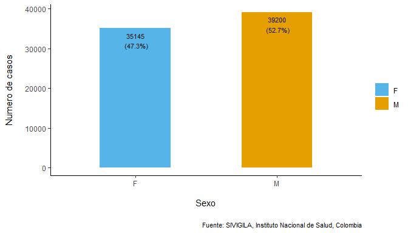
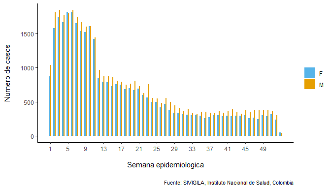

<!-- README.md is generated from README.Rmd. Please edit that file -->

## *sivirep*: Automated reporting from epidemiological surveillance databases 

<!-- badges: start -->

<!-- badges: end -->

Current version of *sivirep* provides functions for data wrangling and
automated reports based on linelist data from
[SIVIGILA](https://www.ins.gov.co/Direcciones/Vigilancia/Paginas/SIVIGILA.aspx),
which is the official epidemiological surveillance system for Colombia,
South America.

## Motivation

Latin America has progressed in the quality of epidemiological
notification and surveillance systems. Particularly, Colombia has
improved over the years the quality and openness of its official
epidemiological surveillance system,
[SIVIGILA](https://www.ins.gov.co/Direcciones/Vigilancia/Paginas/SIVIGILA.aspx).
This system is regulated by Colombia’s National Institute of Health and
operated by thousands of health workers at local secretaries of health,
hospitals, and local notification units.

However, some challenges remain particularly at local levels in terms of
timeliness and quality of epidemiological analytics and epidemiological
reports. These tasks may involve a great deal of manual labor reinforced
by limitations in training for data analytics, time, technology and
quality of internet access in some locations.

`sivirep` is aimed at providing a set of customisable functions for:

1)  downloading, pre-processing and preparing SIVIGILA data for further
    analytics
2)  producing customisable epidemiological automated reports
3)  getting feedback on the surveillance system to the source provider

## Potential users

- Public health professionals and field epidemiologist users of SIVIGILA
  source at local levels
- Epidemiology and public health students
- National and international researchers and data analysts

## Installation

You can install the development version of `sivirep` from GitHub with:

## Quick start

| enfermedad                                                   | aa                                                                                             |
|:-------------------------------------------------------------|:-----------------------------------------------------------------------------------------------|
| ACCIDENTE OFIDICO                                            | 2007, 2008, 2009, 2010, 2011, 2012, 2013, 2014, 2015, 2016, 2017, 2018, 2019, 2020, 2021       |
| AGRESIONES POR ANIMALES POTENCIALMENTE TRANSMISORES DE RABIA | 2007, 2008, 2009, 2010, 2011, 2012, 2013, 2014, 2015, 2016, 2017, 2018, 2019, 2020, 2021       |
| ANOMALIAS CONGENITAS                                         | 2007, 2008, 2009, 2010, 2011, 2012, 2013, 2014, 2015, 2016, 2017, 2018, 2019, 2020, 2021       |
| BAJO PESO AL NACER                                           | 2012, 2013, 2014, 2015, 2016, 2017, 2018, 2019, 2020, 2021                                     |
| CÁNCER DE LA MAMA Y CUELLO UTERINO                           | 2007, 2008, 2009, 2010, 2011, 2012, 2013, 2014, 2015, 2016, 2017, 2018, 2019, 2019, 2020, 2021 |
| CANCER INFANTIL                                              | 2007, 2008, 2009, 2010, 2011, 2012, 2013, 2014, 2015, 2016, 2017, 2018, 2019, 2020, 2021       |
| CHAGAS                                                       | 2007, 2008, 2009, 2010, 2011, 2012, 2013, 2014, 2015, 2016, 2017, 2018, 2019, 2020, 2021       |
| CHIKUNGUNYA                                                  | 2007, 2008, 2009, 2010, 2011, 2012, 2013, 2014, 2015, 2016, 2017, 2018, 2019, 2020, 2021       |
| DENGUE                                                       | 2007, 2008, 2009, 2010, 2011, 2012, 2013, 2014, 2015, 2016, 2017, 2018, 2019, 2020, 2021       |
| DENGUE GRAVE                                                 | 2007, 2008, 2009, 2010, 2011, 2012, 2013, 2014, 2015, 2016, 2017, 2018, 2019, 2020, 2021       |
| DIFTERIA                                                     | 2007, 2008, 2009, 2010, 2011, 2012, 2013, 2014, 2015, 2016, 2017, 2018, 2019, 2021             |
| ENCEFALITIS DEL NILO OCCIDENTAL EN HUMANOS                   | 2007, 2008, 2009, 2010, 2011, 2012, 2013, 2014, 2015, 2016, 2017                               |
| ENCEFALITIS EQUINA DEL OESTE EN HUMANOS                      | 2007, 2008, 2009, 2010, 2011, 2012, 2013, 2014, 2015, 2016, 2017                               |
| ENCEFALITIS EQUINA VENEZOLANA EN HUMANOS                     | 2007, 2008, 2009, 2010, 2011, 2012, 2013, 2014, 2015, 2016, 2017                               |
| ENDOMETRITIS PUERPERAL                                       | 2007, 2008, 2009, 2010, 2011, 2012, 2013, 2014, 2015, 2016, 2017                               |
| ENFERMEDADES HUERFANAS - RARAS                               | 2007, 2008, 2009, 2010, 2011, 2012, 2013, 2014, 2015, 2016, 2017                               |
| ESI - IRAG (VIGILANCIA CENTINELA)                            | 2007, 2008, 2009, 2010, 2011, 2012, 2013, 2014, 2015, 2016, 2017, 2018, 2019, 2020, 2021       |
| EVENTO ADVERSO SEGUIDO A LA VACUNACION                       | 2007, 2008, 2009, 2010, 2011, 2012, 2013, 2014, 2015, 2016, 2017, 2018, 2019, 2020, 2021       |
| FIEBRE AMARILLA                                              | 2007, 2008, 2009, 2010, 2011, 2012, 2013, 2014, 2015, 2016, 2017, 2018                         |
| FIEBRE TIFOIDEA Y PARATIFOIDEA                               | 2007, 2008, 2009, 2010, 2011, 2012, 2013, 2014, 2015, 2016, 2017, 2018, 2019, 2020, 2021       |
| HEPATITIS A                                                  | 2007, 2008, 2009, 2010, 2011, 2012, 2013, 2014, 2015, 2016, 2017, 2018, 2019, 2020, 2021       |
| HEPATITIS C                                                  | 2018, 2019, 2020, 2021                                                                         |
| HIPOTIROIDISMO CONGENITO                                     | 2007, 2008, 2009, 2010, 2011, 2012, 2013, 2014, 2015, 2016, 2017, 2018, 2019, 2020, 2021       |
| INFECCION ASOCIADA A DISPOSITIVOS                            | 2007, 2008, 2009, 2010, 2011, 2012, 2013, 2014, 2015, 2016, 2017                               |
| INFECCION RESPIRATORIA AGUDA GRAVE IRAG INUSITADA            | 2007, 2008, 2009, 2010, 2011, 2012, 2013, 2014, 2015, 2016, 2017, 2018, 2019, 2020, 2021       |
| INTOXICACION POR FARMACOS                                    | 2007, 2008, 2009, 2010, 2011, 2012, 2013, 2014, 2015, 2016, 2017, 2018, 2019, 2020, 2021       |
| INTOXICACION POR METALES PESADOS                             | 2007, 2008, 2009, 2010, 2011, 2012, 2013, 2014, 2015, 2016, 2017, 2018, 2019, 2020, 2021       |
| INTOXICACION POR METANOL                                     | 2007, 2008, 2009, 2010, 2011, 2012, 2013, 2014, 2015, 2016, 2017, 2018, 2019, 2020, 2021       |
| INTOXICACION POR MONOXIDO DE CARBONO Y OTROS GASES           | 2007, 2008, 2009, 2010, 2011, 2012, 2013, 2014, 2015, 2016, 2017, 2018, 2019, 2020, 2021       |
| INTOXICACION POR OTRAS SUSTANCIAS QUIMICAS                   | 2007, 2008, 2009, 2010, 2011, 2012, 2013, 2014, 2015, 2016, 2017, 2018, 2019, 2020, 2021       |
| INTOXICACION POR PLAGUICIDAS                                 | 2007, 2008, 2009, 2010, 2011, 2012, 2013, 2014, 2015, 2016, 2017, 2018, 2019, 2020, 2021       |
| INTOXICACION POR SOLVENTES                                   | 2007, 2008, 2009, 2010, 2011, 2012, 2013, 2014, 2015, 2016, 2017, 2018, 2019, 2020, 2021       |
| INTOXICACION POR SUSTANCIAS PSICOACTIVAS                     | 2007, 2008, 2009, 2010, 2011, 2012, 2013, 2014, 2015, 2016, 2017, 2018, 2019, 2020, 2021       |
| ISO                                                          | 2007, 2008, 2009, 2010, 2011, 2012, 2013, 2014, 2015, 2016, 2017                               |
| LEISHMANIASIS CUTANEA                                        | 2007, 2008, 2009, 2010, 2011, 2012, 2013, 2014, 2015, 2016, 2017, 2018, 2019, 2020, 2021       |
| LEISHMANIASIS MUCOSA                                         | 2007, 2008, 2009, 2010, 2011, 2012, 2013, 2014, 2015, 2016, 2017, 2018, 2019, 2020, 2021       |
| LEISHMANIASIS VISCERAL                                       | 2007, 2008, 2009, 2010, 2011, 2012, 2013, 2014, 2015, 2016, 2017, 2018, 2019, 2020, 2021       |
| LEPRA                                                        | 2007, 2008, 2009, 2010, 2011, 2012, 2013, 2014, 2015, 2016, 2017, 2018, 2019, 2020, 2021       |
| LEPTOSPIROSIS                                                | 2007, 2008, 2009, 2010, 2011, 2012, 2013, 2014, 2015, 2016, 2017, 2018, 2019, 2020, 2021       |
| LEUCEMIA AGUDA PEDIATRICA LINFOIDE                           | 2007, 2008, 2009, 2010, 2011, 2012, 2013, 2014, 2015, 2016, 2017, 2018, 2019, 2020, 2021       |
| LEUCEMIA AGUDA PEDIATRICA MIELOIDE                           | 2007, 2008, 2009, 2010, 2011, 2012, 2013, 2014, 2015, 2016, 2017, 2018, 2019, 2020, 2021       |
| MALARIA ASOCIADA (FORMAS MIXTAS)                             | 2007, 2008, 2009, 2010, 2011, 2012, 2013, 2014, 2015, 2016, 2017, 2018, 2019, 2020, 2021       |
| MALARIA COMPLICADA                                           | 2007, 2008, 2009, 2010, 2011, 2012, 2013, 2014, 2015, 2016, 2017, 2018, 2019, 2020, 2021       |
| MALARIA FALCIPARUM                                           | 2007, 2008, 2009, 2010, 2011, 2012, 2013, 2014, 2015, 2016, 2017, 2018, 2019, 2020, 2021       |
| MALARIA VIVAX                                                | 2007, 2008, 2009, 2010, 2011, 2012, 2013, 2014, 2015, 2016, 2017, 2018, 2019, 2020, 2021       |
| MENINGITIS OTROS                                             | 2007, 2008, 2009, 2010, 2011, 2012, 2013, 2014, 2015, 2016, 2017                               |
| MENINGITIS MENINGOCÓCICA                                     | 2007, 2008, 2009, 2010, 2011, 2012, 2013, 2014, 2015, 2016, 2017, 2018, 2019, 2019, 2020, 2021 |
| MENINGITIS POR HAEMOPHILUS INFLUENZAE                        | 2007, 2008, 2009, 2010, 2011, 2012, 2013, 2014, 2015, 2016, 2017, 2018, 2019, 2019, 2020, 2021 |
| MENINGITIS POR NEUMOCOCO                                     | 2007, 2008, 2009, 2010, 2011, 2012, 2013, 2014, 2015, 2016, 2017, 2018, 2019, 2019, 2020, 2021 |
| MENINGITIS TUBERCULOSA                                       | 2007, 2008, 2009, 2010, 2011, 2012, 2013, 2014, 2015, 2016, 2017, 2018, 2019, 2020, 2021       |
| MORBILIDAD MATERNA EXTREMA                                   | 2007, 2008, 2009, 2010, 2011, 2012, 2013, 2014, 2015, 2016, 2017, 2018, 2019, 2020, 2021       |
| MORBILIDAD POR IRA                                           | 2012, 2013, 2014, 2015, 2016, 2017, 2018, 2019, 2020, 2021                                     |
| MORTALIDAD MATERNA                                           | 2007, 2008, 2009, 2010, 2011, 2012, 2013, 2014, 2015, 2016, 2017, 2018, 2019, 2020, 2021       |
| MORTALIDAD PERINATAL Y NEONATAL TARDIA                       | 2008, 2009, 2010, 2011, 2012, 2013, 2014, 2015, 2016, 2017, 2018, 2019, 2020, 2021             |
| MORTALIDAD POR DENGUE                                        | 2007, 2008, 2009, 2010, 2011, 2012, 2013, 2014, 2015, 2016, 2017, 2018, 2019, 2020, 2021       |
| MORTALIDAD POR DESNUTRICION                                  | 2013, 2014, 2015, 2016, 2017, 2018, 2019, 2020, 2021                                           |
| MORTALIDAD POR EDA 0-4 AÑOS                                  | 2007, 2008, 2009, 2010, 2011, 2012, 2013, 2014, 2015, 2016, 2017, 2018, 2019, 2019, 2020, 2021 |
| MORTALIDAD POR IRA                                           | 2007, 2008, 2009, 2010, 2011, 2012, 2013, 2014, 2015, 2016, 2017, 2018, 2019, 2020, 2021       |
| MORTALIDAD POR MALARIA                                       | 2007, 2008, 2009, 2010, 2011, 2012, 2013, 2014, 2015, 2016, 2017, 2018, 2019, 2020, 2021       |
| PARALISIS FLACIDA AGUDA (MENORES DE 15 AÑOS)                 | 2007, 2008, 2009, 2010, 2011, 2012, 2013, 2014, 2015, 2016, 2017, 2018, 2019, 2020             |
| PAROTIDITIS                                                  | 2007, 2008, 2009, 2010, 2011, 2012, 2013, 2014, 2015, 2016, 2017, 2018, 2019, 2020, 2021       |
| RUBEOLA                                                      | 2007, 2008, 2009, 2010, 2011, 2012, 2013, 2014, 2015, 2016, 2017                               |
| SARAMPION                                                    | 2007, 2008, 2009, 2010, 2011, 2012, 2013, 2014, 2015, 2016, 2017, 2018, 2019, 2020             |
| SINDROME DE RUBEOLA CONGENITA                                | 2007, 2008, 2009, 2010, 2011, 2012, 2013, 2014, 2015, 2016, 2017                               |
| TETANOS ACCIDENTAL                                           | 2007, 2008, 2009, 2010, 2011, 2012, 2013, 2014, 2015, 2016, 2017, 2018, 2019, 2020, 2021       |
| TETANOS NEONATAL                                             | 2007, 2008, 2009, 2010, 2011, 2012, 2013, 2014, 2015, 2016, 2017, 2018, 2019, 2020, 2021       |
| TOS FERINA                                                   | 2007, 2008, 2009, 2010, 2011, 2012, 2013, 2014, 2015, 2016, 2017, 2018, 2019, 2020, 2021       |

## Future versions

Future versions of `sivirep` may include

- Interaction with other data sources in Colombia
- Other epidemiological surveillance systems in Latin America

## Contributions

Contributions are welcome via [pull
requests](https://github.com/epiverse-trace/sivirep/pulls).

Contributors to the project include:

- [Geraldine Gómez-Millán](https://github.com/GeraldineGomez) (author)

- [Zulma M. Cucunubá](https://github.com/zmcucunuba) (author)

- [Hugo Gruson](https://github.com/Bisaloo) (contributor)

- Laura Gómez-Bermeo (contributor to documentation)

## Code of Conduct

Please note that the linelist project is released with a [Contributor
Code of
Conduct](https://contributor-covenant.org/version/2/0/CODE_OF_CONDUCT.html).
By contributing to this project, you agree to abide by its terms.

## Get Started

### For automated reporting

After installation and importation of the library you can start using
`sivirep`:

Check the list of diseases available to make a report with `sivirep` in:

Currently, `sivirep` provides a report template
`Reporte Básico {sivirep}`, which contains six sections and receive two
input parameters: disease (the disease name) and year in order to
download the data from SIVIGILA source.

The template can be used by following the following steps:

1.  In RStudio click *‘File/New File/R’* Markdown:

2.  Select the left panel option: *‘From Template’*, then select the
    template report called `Reporte Básico {sivirep}`, indicate the name
    you want for the report (i.e. MyReport_Laura), the location to store
    it and press *‘Ok’*.

3.  Then, you can select the disease (the disease name) and the year of
    the report. This action will download the data wanted and also will
    provide the template in R Markdown .Rmd file. For this, it is
    important to find Knit button, display the options and select *‘Knit
    with parameters’*.

4.  Wait a few seconds while the report is rendered in a PDF file.

5.  You can add, edit, delete and customise sections of the report in
    the R Markdown file generated earlier.

For more details on generic Rmarkdown templates and reports please see
[rmarkdown
templates](https://rstudio.github.io/rstudio-extensions/rmarkdown_templates.html).

## For customisable analytics or reports

This section provides a basic set of instructions for using `sivirep`
0.0.1 if: - You have already produced an .Rmd file and you want to edit
a report - You want to perform customised analytics without an .Rmd file

### 1. Importing sivigila data

The SIVIGILA source provides the historical linelist data up to the
latest closed epidemiological year. The closing of an epidemiological
year usually occurs in April next year (i.e. if you’re using `sivirep`
in march 2023, you may be able to access the historical data up to
December 2021) for most diseases with a few exceptions.

Please check the available diseases and years, using:

Once you have decided the disease and year you want,
`import_linelist_disease_year` is the function that allows importation
of data from sivigila service using a parameterised format based on
disease and year.

##### 💡 Tip 1 - Avoid time delays when importing data

- `sivirep` 0.0.1 is meant to assist with access to SIVIGILA source.
  This process of downloading the information may take a few minutes
  depending on the size of the dataset. To avoid repeating downloading
  the same data every time you can use `cache = TRUE` in the function
  `import_linelist_disease_year` This option is set by default.

### 2. Cleansing sivigila data

SIVILA data is a highly trusted official source of information with ISO
certification of data quality. Nevertheless, sometimes there are some
potential outliers in the data that may need some additional cleansing.

`sivirep` provides a wrapper generic function called
`cleansing_sivigila_data` for identifying and correcting errors,
inconsistencies, and discrepancies in the datasets to improve their
quality and accuracy. This process can include removing duplicates,
correcting typographical errors, imputing missing values, and validating
data, among other tasks, such as removing improbable dates, cleaning
geolocation codes, and standardising column names and age categories.

The cleansing functions inside `cleansing_sivigila_data` have been
gathered and built based on the experience from field epidemiologists.
These may include internal functions such as: `clean_labels`: function
that cleans and standardises the column names of SIVIGILA linelist data
based on SIVIGILA data dictionary.

- `clean_disease_ages`: function that cleans ages of SIVIGILA linelist
  data
- `format_dates_values`: function that gives a specific format to a date
- `clean_disease_dates`: function that cleans dates from the disease
  data
- `clean_depto_codes`: function that cleans the geographical department
  codes of the disease data

The user may want to use these functions individually or simply use the
generic wrapper cleansing function `cleansing_sivigila_data`

### 3. Temporal distribution of cases

In `sivirep` the temporal distribution of cases is defined by the
variables symptom onset date and notification date, for each of these
variables there are specialised functions to group the data and generate
the plots.

#### 3.1. Group the data by onset symptoms at the desired temporal scale

To generate the distribution of cases by symptom onset date it is
necessary to group the data by these variables. `sivirep` provides a
function that allows this grouping called `group_onset_symptoms`, in
which you can specify the time unit to group these dates, the allowed
values for this parameter are: day and month.

##### 💡 Tip 2 - Get the first n months with most cases

- When building a report section or analysing this data it can be useful
  to get the months with the most cases, in `sivirep` you can use the
  function `get_months_most_cases` to get this information.

The graph that allows to visualise this distribution must be generated
with the function `plot_onset_symptoms`. Please notice that even if you
have grouped the data by day you may prefer to plot it by month, as in:

<!-- -->

#### 3.2. Group the data by notification date at the desired temporal scale

The process to generate the distribution of cases by notification date
consist in group the disease data by this variables, you can use the
following function of `sivirep` to do this:

The graph that allows to visualise this distribution must be generated
with the function `plot_notification_date`. Please notice that even if
you have grouped the data by day you may prefer to plot it by month, as
in:

<!-- -->

### 4. Age and sex

### 4.1. Sex variable

When analysing or reporting disease data, it is often necessary to
determine the distribution of cases by gender or sex. However, the
SIVIGILA source only records sex.

`sivirep` provides a function that aggregates and computes percentages
by sex automatically after the cleansing process.

Also, `sivirep` has a `plot_sex` function:

<!-- -->

The distribution of cases by sex and epidemiological week can be using
the `group_sex_epiweek` function provided by `sivirep`

The corresponding visualisation function is `plot_sex_epiweek` that
provides `sivirep`:

<!-- -->

### 4.2. Age variable

Age is an important variable to analyse, as it is a known risk factor
for many diseases. Certain diseases and conditions tend to occur more
frequently in specific age groups, and this distribution can help
identify populations at higher risk and implement targeted prevention
and control strategies.

`sivirep` provides a function called `group_age`, which can group
disease data by age groups. By default this function produces age ranges
with intervals of 10 years. Also, users can customise a different age
range.

The corresponding plot function is `plot_age`

<!-- -->

### 4.3. Age and sex simultaneously

`sivirep` provides a function called `group_age_sex`, which can group
disease data by age ranges and sex simultaneously and obtain their
number of cases and percentages. Also, the age interval can be
customised.

The corresponding plotting function is `plot_age_sex`.

<!-- -->

### 5. Spatial distribution of cases

Obtaining the spatial distribution of cases is helpful to identify areas
with a high concentration of cases, disease clusters and environmental
or social risk factors.

In Colombia, there 32 administrative geographic units (adm1) called
departments. `sivirep` provides a function called `group_deptos` which
allows obtaining a data.frame of grouped cases by department.

Currently, with the function called `plot_dept_map` the user can produce
a static map of Colombia with the distribution of cases by departments.

<!-- -->

##### 💡 Tip 3 - Get the row with most cases

- When building a report section or analysing this data it can be
  helpful to know which gender has the most cases, in `sivirep` you can
  use the function `get_most_cases` to get this information. This
  function works with any dataset that contains a column called “cases”
  by any level of aggregation.
