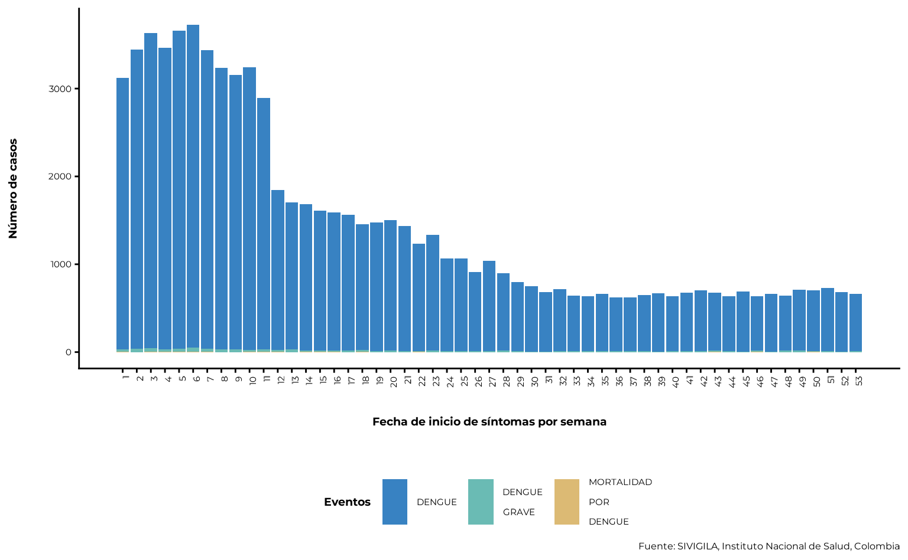
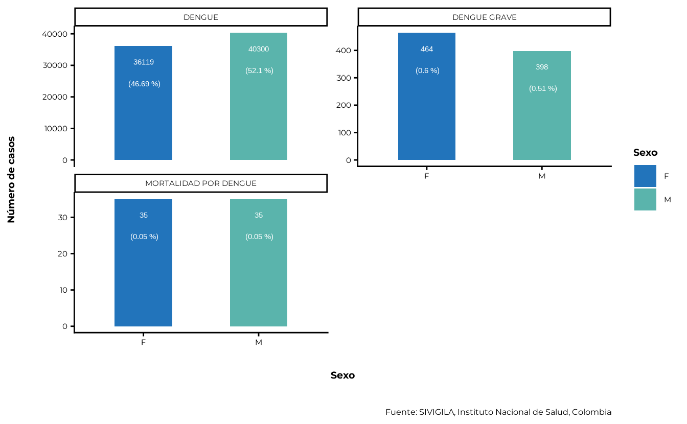
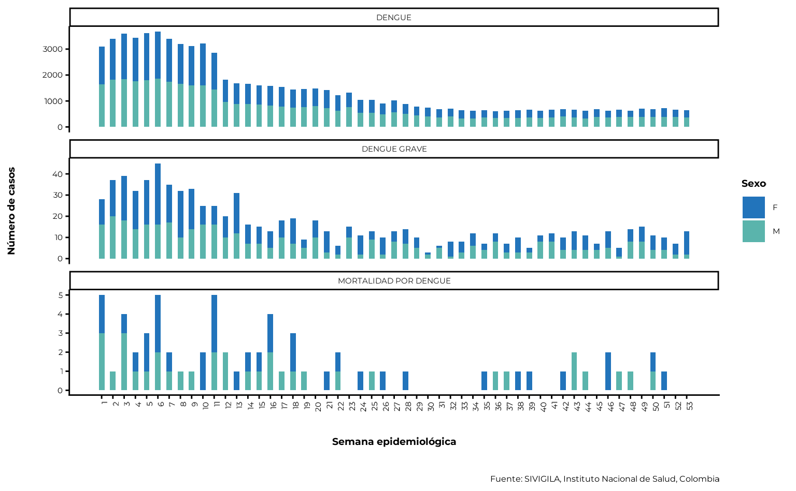
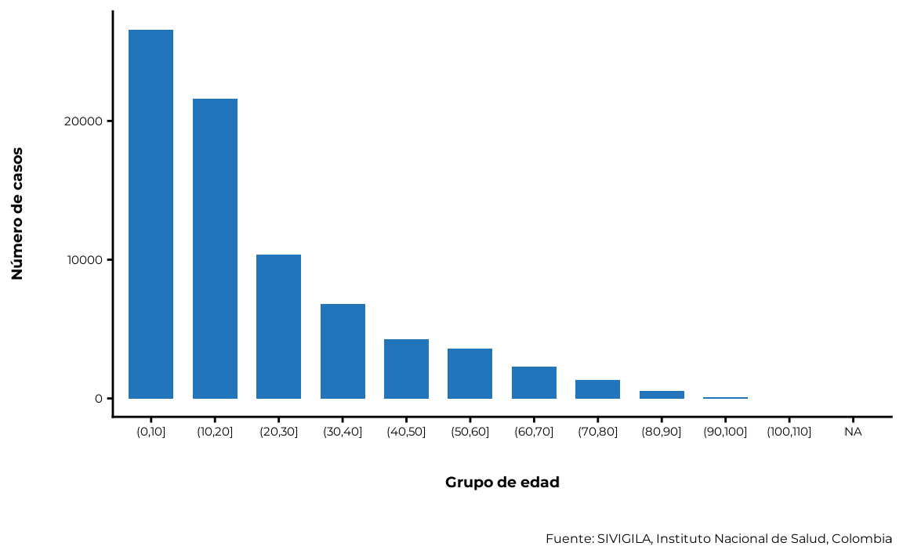
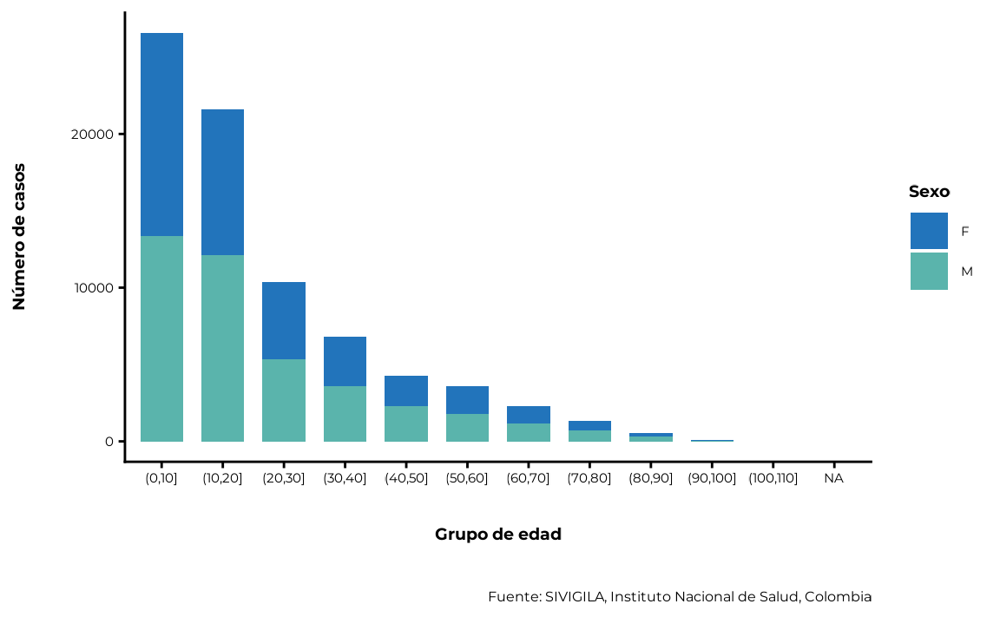
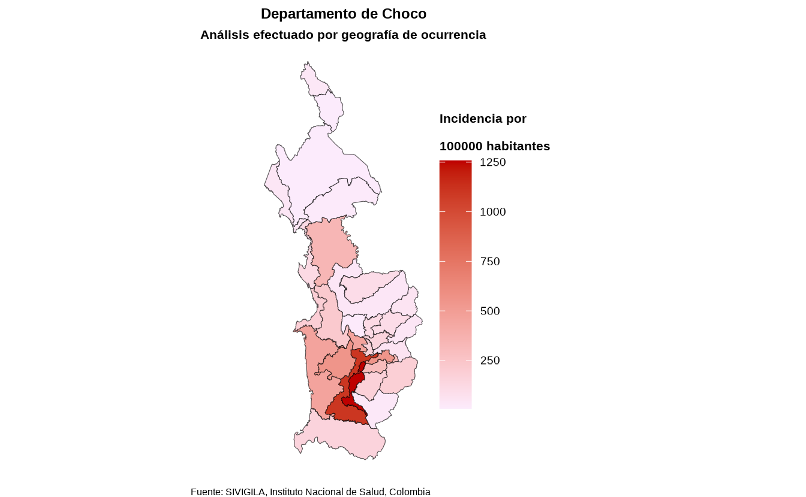

# Análisis personalizados

A continuación se describe un conjunto básico de instrucciones para usar
`sivirep` si:

- Ya has producido un archivo .Rmd y deseas editar un reporte.
- Deseas realizar análisis personalizados sin un archivo .Rmd.

### Configuración

Puedes comenzar importando el paquete a través del siguiente comando:

``` r
library(sivirep)
```

### 1. Importación de datos de SIVIGILA

La fuente de SIVIGILA proporciona los datos de la lista de casos
históricos hasta el último año epidemiológico cerrado. El cierre de un
año epidemiológico generalmente ocurre en abril del siguiente año (por
ejemplo, si estás utilizando `sivirep` en marzo de 2023, es posible que
puedas acceder a los datos históricos hasta diciembre de 2021) para la
mayoría de las enfermedades, con algunas excepciones.

Por favor, verifica las enfermedades y años disponibles utilizando:

``` r
lista_eventos <- list_events()
```

Una vez que hayas decidido la enfermedad y el año de la cual deseas
obtener la información, `import_data_event` es la función que permite la
importación de datos desde la fuente de SIVIGILA utilizando un formato
parametrizado basado en la enfermedad y el año.

``` r
data_event <- import_data_event(
  nombre_event = "Dengue",
  years = 2020,
  cache = TRUE
)
```

> 💡 **Tip 1 - Evita retrasos de tiempo al importar datos**  
> `sivirep` está diseñado para ayudar con el acceso a la fuente
> SIVIGILA. El proceso de descarga de información sobre enfermedades
> puede tomar varios minutos dependiendo del tamaño del conjunto de
> datos. Para evitar volver a descargar los mismos datos cada vez,
> puedes utilizar el parámetro `cache = TRUE` en la función
> `import_data_event`.

> 💡 **Tip 2 - Descarga datos de enfermedades para múltiples años**  
> Con la función `import_data_event`, es posible descargar datos para
> múltiples años. Por ejemplo, si deseas descargar datos de 3 años de
> una enfermedad en particular, puedes usar el parámetro `year` de la
> siguiente manera:
> `import_data_event(data_event = "dengue", years = c(2021, 2019, 2018), cache = TRUE)`
> También puedes especificar años no consecutivos:
> `import_data_event(data_event = "dengue", years = c(2024, 2018, 2013), cache = TRUE)`

### 2. Limpieza de datos de SIVIGILA

Los datos de SIVIGILA son una fuente de información oficial altamente
confiable, con certificación ISO de calidad de datos. Sin embargo, a
veces puede haber algunos valores atípicos en los datos que requieran
una limpieza adicional.

`sivirep` proporciona una función genérica llamada
`limpiar_data_sivigila` que envuelve diversas tareas para identificar y
corregir errores, inconsistencias y discrepancias en los conjuntos de
datos con el fin de mejorar su calidad y precisión. Este proceso puede
incluir la eliminación de duplicados, la corrección de errores
tipográficos, el reemplazo de valores faltantes y la validación de
datos, entre otras tareas, como eliminar fechas improbables, limpiar
códigos de geolocalización y estandarizar los nombres de las columnas y
las categorías de edad.

``` r
data_event_limpia <- limpiar_data_sivigila(data_event = data_event)
```

Las funciones de limpieza dentro de `limpiar_data_sivigila` se han
recopilado y creado en base a la experiencia de epidemiólogos de campo.

Estas pueden incluir funciones internas como:

- `limpiar_columnas_event`: función que limpia y estandariza los nombres
  de columnas de los datos del SIVIGILA.
- `limpiar_edad_event`: función que limpia y estandariza las edades a
  años, según la clasificación del INS.
- `limpiar_val_atipic`: función que limpia valores atípicos de los datos
  de enfermedades.
- `limpiar_fecha_event`: función que limpia y estandariza fechas de los
  datos de enfermedades.
- `estandarizar_geo_cods`: función que estandariza los códigos
  geográficos, según la codificación DIVIPOLA.
- `convert_edad`: función que convierte edades a años según las unidades
  de medida del SIVIGILA.

Puedes utilizar estas funciones individualmente o simplemente usar la
función genérica de limpieza.

### 3. Filtrar casos

`sivirep` proporciona una función que permite filtrar los datos de
enfermedades por departamento o nombre del municipio llamada
`geo_filtro`. Esto permite al usuario crear un informe a nivel
subnacional, seleccionando casos específicos basados en la ubicación
geográfica.

``` r
data_event_filtrada <- geo_filtro(
  data_event = data_event_limpia,
  dpto = "Choco"
)
```

### 4. Distribución temporal de casos

En `sivirep`, la distribución temporal de casos se define por las
variables de fecha de inicio de síntomas y fecha de notificación. Para
cada una de estas variables, existen funciones especializadas para
agrupar los datos y generar los gráficos.

#### 4.1. Agrupar los datos por fecha de inicio de síntomas en la escala temporal deseada

Para generar la distribución de casos por fecha de inicio de síntomas,
es necesario agrupar los datos por estas variables. `sivirep`
proporciona una función que permite esta agrupación llamada
`agrupar_fecha_inisintomas`.

``` r
casos_ini_sintomas <- agrupar_fecha_inisintomas(
  data_event = data_event_limpia
)
```

> 💡 **Tip**: Obtén los primeros n meses con más casos
>
> Al construir una sección del reporte o analizar estos datos, puede ser
> útil obtener los meses con más casos. En `sivirep`, puedes utilizar la
> función `obtener_meses_mas_casos` para obtener esta información.

El gráfico que permite visualizar esta distribución se debe generar con
la función `plot_fecha_inisintomas`. Ten en cuenta que, incluso si has
agrupado los datos por día, es posible que prefieras representarlo por
semana epidemiológica, como en:

``` r
plot_fecha_inisintomas(
  data_agrupada = casos_ini_sintomas,
  uni_marca = "semanaepi"
)
```



### 5. Edad y sexo

### 5.1. Variable de sexo

Cuando se analizan o se informan datos de enfermedades, a menudo es
necesario determinar la distribución de casos por género o sexo. Sin
embargo, la fuente de SIVIGILA solo registra el sexo.

`sivirep` proporciona una función que agrega y calcula automáticamente
los porcentajes por sexo después del proceso de limpieza.

``` r
casos_sex <- agrupar_sex(
  data_event = data_event_limpia,
  porcentaje = TRUE
)
```

Además, `sivirep` cuenta con una función para generar el gráfico por
esta variable llamada `plot_sex`:

``` r
plot_sex(data_agrupada = casos_sex)
```



La distribución de casos por sexo y semana epidemiológica se puede
generar utilizando la función `agrupar_sex_semanaepi` proporcionada por
`sivirep`.

``` r
casos_sex_semanaepi <- agrupar_sex_semanaepi(data_event = data_event_limpia)
```

La función de visualización correspondiente es `plot_sex_semanaepi`, que
`sivirep` proporciona para mostrar la distribución de casos por sexo y
semana epidemiológica.

``` r
plot_sex_semanaepi(data_agrupada = casos_sex_semanaepi)
```



### 5.2. Variable de edad

La edad es una variable importante para analizar, ya que es un factor de
riesgo conocido para muchas enfermedades. Ciertas enfermedades y
condiciones tienden a ocurrir con más frecuencia en grupos de edad
específicos, y esta distribución puede ayudar a identificar poblaciones
con mayor riesgo e implementar estrategias de prevención y control
dirigidas.

`sivirep` proporciona una función llamada `agrupar_edad`, que puede
agrupar los datos de enfermedades por grupos de edad. De forma
predeterminada, esta función produce rangos de edad con intervalos de 10
años. Además, los usuarios pueden personalizar un rango de edad
diferente.

``` r
casos_edad <- agrupar_edad(data_event = data_event_limpia, interval_edad = 10)
```

La función de visualización correspondiente es `plot_edad`.

``` r
plot_edad(data_agrupada = casos_edad)
```



### 5.3. Edad y sexo simultáneamente

`sivirep` proporciona una función llamada `agrupar_edad_sex`, que puede
agrupar los datos de enfermedades por rangos de edad y sexo de forma
simultánea y obtener el número de casos y los porcentajes
correspondientes. Además, permite personalizar el intervalo de edad.

``` r
casos_edad_sex <- agrupar_edad_sex(
  data_event = data_event_limpia,
  interval_edad = 10
)
```

La función de visualización correspondiente es `plot_edad_sex`.

``` r
plot_edad_sex(data_agrupada = casos_edad_sex)
```



### 6. Distribución espacial de casos

Obtener la distribución espacial de los casos es útil para identificar
áreas con una alta concentración de casos, agrupaciones de enfermedades
y factores de riesgo ambientales o sociales.

En Colombia, existen 32 unidades geográficas administrativas (adm1)
llamadas departamentos.

`sivirep` proporciona una función llamada `agrupar_mpio` que te permite
obtener datos de enfermedades agrupados por municipios de un
departamento específico

``` r
dist_esp_mpio <- agrupar_mpio(
  data_event = data_event_filtrada,
  dpto = "Choco"
)
```

También existe una función para obtener la distribución de casos en
todos los departamentos de Colombia, llamada `agrupar_dpto`:

``` r
dist_esp_dpto <- agrupar_dpto(data_event = data_event_limpia)
```

Actualmente, con la función llamada `plot_map`, el usuario puede generar
un mapa estático de Colombia que muestra la distribución de casos por
departamentos y municipios.

> 💡 **Tip - Evita retrasos al generar el mapa**  
> Es necesario descargar los archivos shapefiles de Colombia para
> generar el mapa. Para evitar volver a descargarlos cada vez que lo
> quieras generar, puedes utilizar el parámetro `cache = TRUE` en la
> función `plot_map`.

> 💡 **Tip**: Obtener la fila con mayor número de casos Al construir una
> sección del reporte o analizar estos datos, puede ser útil  
> saber cuál es la variable que tiene la mayoría de los casos. En
> `sivirep`, puedes utilizar la función `obtener_fila_mas_casos` para
> obtener esta  
> información. Esta función funciona con cualquier conjunto de datos
> que  
> contenga una columna llamada `"casos"` en cualquier nivel de
> agregación.

### 7. Incidencia

Con `sivirep`, puedes calcular tasas de incidencia por geografía o sexo
utilizando las proyecciones poblacionales del DANE o la población a
riesgo, dependiendo de la enfermedad y la disponibilidad de los datos.

> 📑 **Nota:** `sivirep` no incluye datos de población a riesgo para
> todos los eventos o enfermedades. Sin embargo, si tienes esta
> información, puedes proporcionarla usando el parámetro
> `data_incidencia` en cada función.

#### 7.1 Incidencia por geografía

Puedes calcular la incidencia por los departamentos de Colombia o por
los municipios de un departamento específico, utilizando la función
`calcular_incidencia_geo`:

##### 7.1.1 Mapa de incidencia por geografía

Con la función `plot_map` puedes visualizar y generar un mapa con las
incidencias a nivel naciona, para un departamento o municipio
específico, dependiendo de tus parámetros y los cálculos realizados.

``` r
mapa <- plot_map(data_agrupada = incidencia_muns$data_incidencia,
                 ruta_dir = tempdir())
mapa
```



#### 7.2 Incidencia por sexo

`sivirep` proporciona una función llamada `calcular_incidencia_sex` que
te permite calcular la incidencia por sexo a nivel nacional (Colombia),
o para un departamento o municipio específico.

#### 7.3 Incidencia total en el país

La función `calcular_incidencia` te permite calcular la incidencia para
todo el país:
