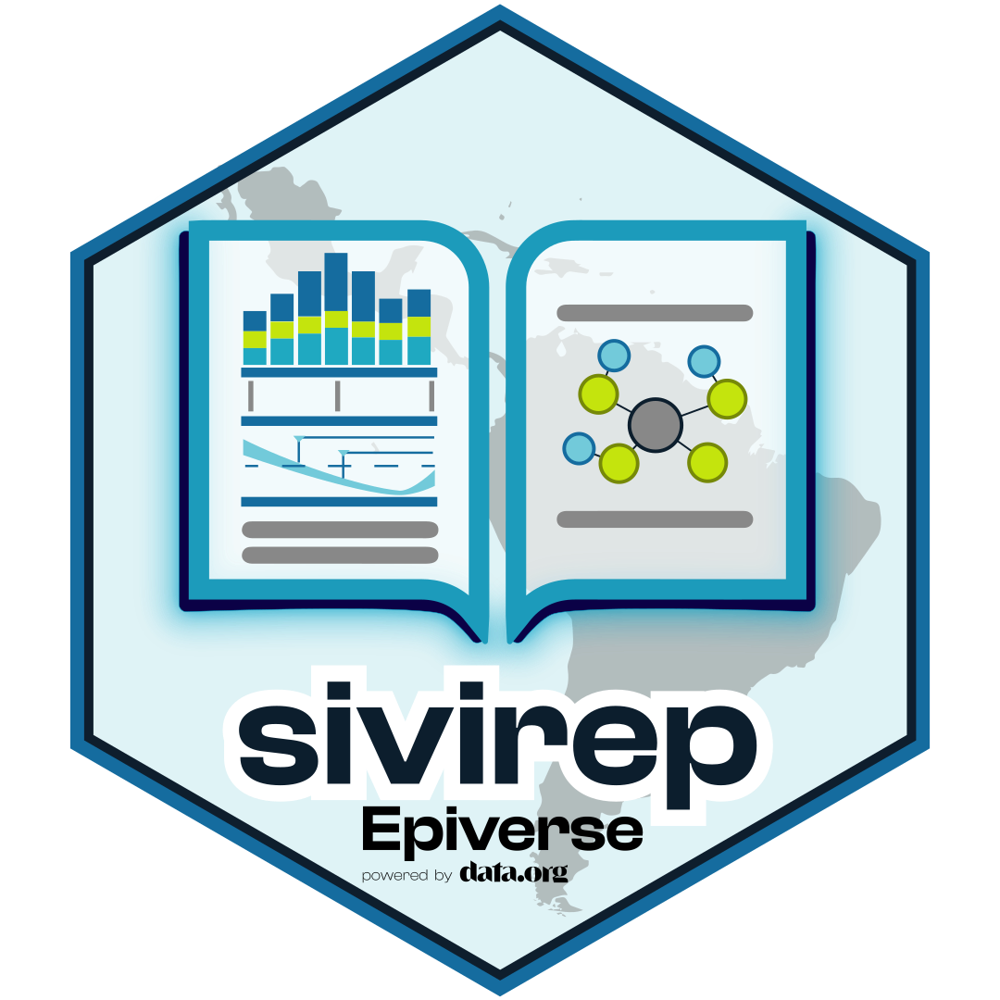

## *sivirep*: Generación automatizada de reportes a partir de bases de datos de vigilancia epidemiológica 

[For English version, open this
link](https://epiverse-trace.github.io/sivirep/articles/sivirep_en.html)

***sivirep*** es desarrollado por la [Pontificia Universidad
Javeriana](https://www.javeriana.edu.co/inicio) como parte de la
iniciativa [Epiverse](https://data.org/initiatives/epiverse/).

La versión actual de *sivirep* 1.0.0 proporciona funciones para la
manipulación de datos y la generación de reportes automatizados basados
en las bases de datos individualizadas de casos de SIVIGILA, que es el
sistema oficial de vigilancia epidemiológica de Colombia.

## Exclusión de responsabilidad

El uso de esta librería, así como de los datos, reportes generados y
otros productos derivados de la misma, se realiza bajo la
responsabilidad exclusiva del usuario. Ni los autores de la librería, ni
la Pontificia Universidad Javeriana, ni la fuente de información asumen
responsabilidad alguna por los resultados obtenidos o el uso que se haga
de dichos productos.

## Motivación

América Latina ha progresado en la calidad de sus sistemas de
notificación y vigilancia epidemiológica. En particular, Colombia ha
mejorado a lo largo de los años la calidad, la accesibilidad y la
transparencia de su sistema oficial de vigilancia epidemiológica,
SIVIGILA. Este sistema está regulado por el Instituto Nacional de Salud
de Colombia y es operado por miles de trabajadores de la salud en las
secretarías de salud locales, hospitales y unidades primarias
generadoras de datos.

Sin embargo, todavía existen desafíos, especialmente a nivel local, en
cuanto a la oportunidad y la calidad del análisis epidemiológico y de
los informes epidemiológicos. Estas tareas pueden requerir una gran
cantidad de trabajo manual debido a limitaciones en el entrenamiento
para el análisis de datos, el tiempo que se requiere invertir, la
tecnología y la calidad del acceso a internet en algunas regiones de
Colombia.

El objetivo de `sivirep` es proporcionar un conjunto de herramientas
para:

1.  Descargar, preprocesar y preparar los datos de SIVIGILA para su
    posterior análisis.
2.  Generar informes epidemiológicos automatizados adaptables al
    contexto.
3.  Proporcionar retroalimentación sobre el sistema de vigilancia al
    proveedor de la fuente de datos.

## Potenciales usuarios

- Profesionales de salud pública y de epidemiología de campo que
  utilizan la fuente de datos de SIVIGILA a nivel local.
- Estudiantes del área de la salud y epidemiología.
- Investigadores y analistas de datos a nivel nacional e internacional.

## Versiones futuras

Las versiones futuras de `sivirep` podrían incluir:

- Interacción con otras fuentes de datos en Colombia.
- Otros sistemas de vigilancia epidemiológica en América Latina.

## Contribuciones

Las contribuciones son bienvenidas via [pull
requests](https://github.com/epiverse-trace/sivirep/pulls).

Los contribuyentes al paquete incluyen:

**Autores**: [Geraldine
Gómez-Millán](https://github.com/GeraldineGomez), [Zulma M.
Cucunubá](https://github.com/zmcucunuba), Jennifer A. Mendez-Romero y
[Claudia Huguett-Aragón](https://github.com/chuguett)

**Contribuyentes**: [Hugo Gruson](https://github.com/Bisaloo), [Juanita
Romero-Garcés](https://github.com/juanitaromerog), [Jaime A.
Pavlich-Mariscal](https://github.com/jpavlich), [Andrés
Moreno](https://github.com/andresmore), [Miguel
Gámez](https://github.com/megamezl), [Laura
Gómez-Bermeo](https://github.com/lgbermeo), Johan Calderón, Lady
Flórez-Tapiero, Verónica Tangarife-Arredondo y Gerard Alarcon

## Código de conducta

Por favor, ten en cuenta que el proyecto `sivirep` se publica con un
[Código de Conducta para
Contribuyentes](https://contributor-covenant.org/version/2/0/CODE_OF_CONDUCT.html).
Al contribuir a este proyecto, aceptas cumplir con sus términos.

## Instalación

Por ahora `sivirep` no es posible instalarlo desde CRAN.

Para instalar la versión estable de `sivirep` desde GitHub puedes
hacerlo con el siguiente comando:

``` r
install.packages("pak")
pak::pak("epiverse-trace/sivirep")
```

También, puedes utilizar cualquiera de estas dos opciones:

``` r
install.packages("remotes")
remotes::install_github("epiverse-trace/sivirep")
```

``` r
install.packages("sivirep", repos = c("https://epiverse-trace.r-universe.dev", "https://cloud.r-project.org"))
```

## Inicio rápido

Puedes iniciar importando el paquete después de finalizada su
instalación con el siguiente comando:

``` r
library(sivirep)
```

Puedes revisar las enfermedades y los años disponibles para su descarga
de forma libre utilizando los comandos:

``` r
lista_eventos <- list_events()
knitr::kable(lista_eventos)
```

> 🦠**Listado de enfermedades (haz clic para ver)**
>
>   
>
> - [Enfermedades](https://epiverse-trace.github.io/sivirep/articles/resources.html#enfermedades-y-a%C3%B1os-disponibles-para-su-descarga)

## Reporte automatizado

Actualmente, `sivirep` provee una plantilla de reporte llamada
`Reporte Evento {sivirep}`, la cual recibe los siguientes parámetros de
entrada: el nombre de la enfermedad, el año, el nombre del país, el
nombre del departamento (opcional) y el nombre del municipio (opcional)
para descargar los datos de la fuente de SIVIGILA.

Para hacer uso de la plantilla del reporte puedes seguir los siguientes
pasos:

> 🎥 [¿Cómo generar un reporte con
> sivirep?](https://youtu.be/wsgXQKEeg8I)

El reporte que obtendrás al utilizar la plantilla de `sivirep` es este:

> 🎥 [Reporte sivirep](https://youtu.be/NRUNwVrs4io)

Si deseas generar el reporte en formato PDF debes instalar LateX. Puedes
instalarlo siguiendo las instrucciones que se encuentran en [R Markdown
Cookbook](https://bookdown.org/yihui/rmarkdown-cookbook/install-latex.html).

## Análisis personalizados

`sivirep` ofrece un conjunto de funciones que pueden utilizarse en
distintos escenarios: desde la descarga de datos hasta la creación de
análisis personalizados o la construcción de flujos de trabajo
completos.

Para explorar las funciones disponibles y ejemplos de su uso, visita la
página de [Análisis
personalizados](https://epiverse-trace.github.io/sivirep/articles/custom_analysis.html).
